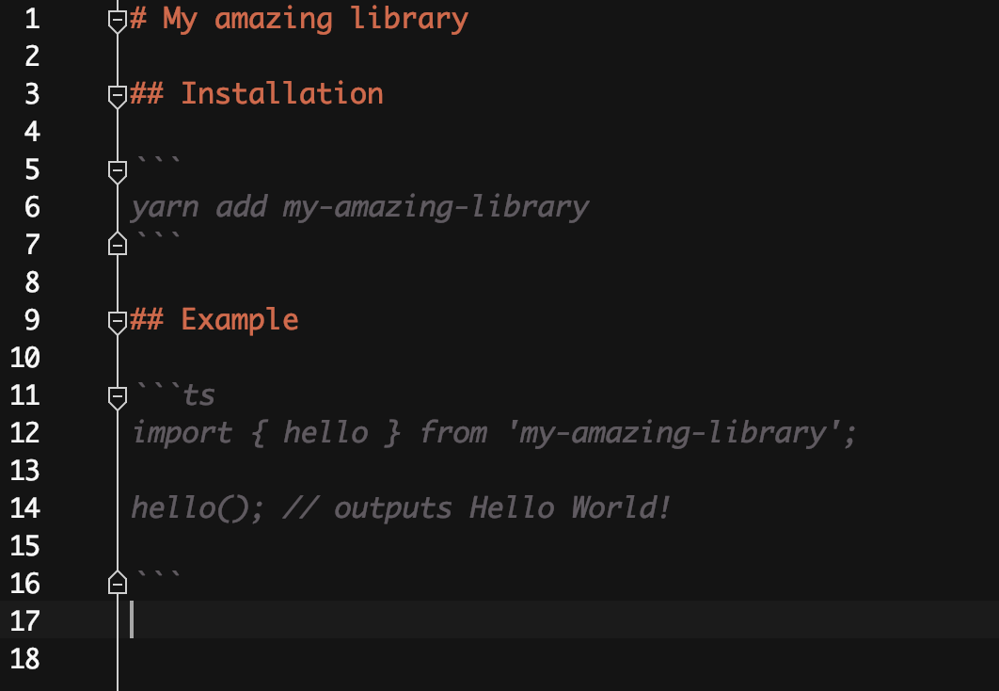
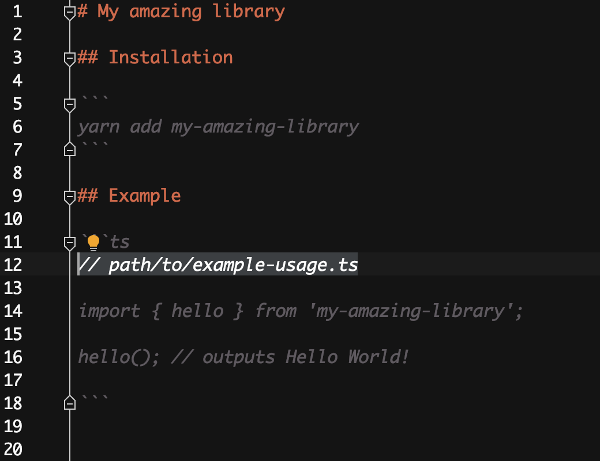
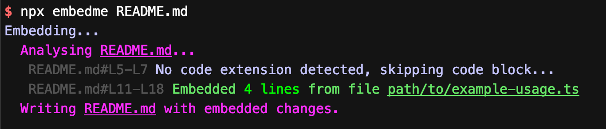
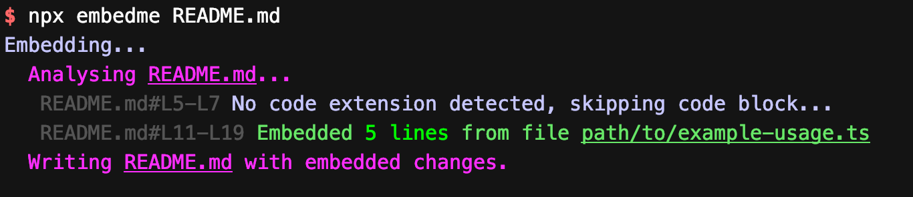
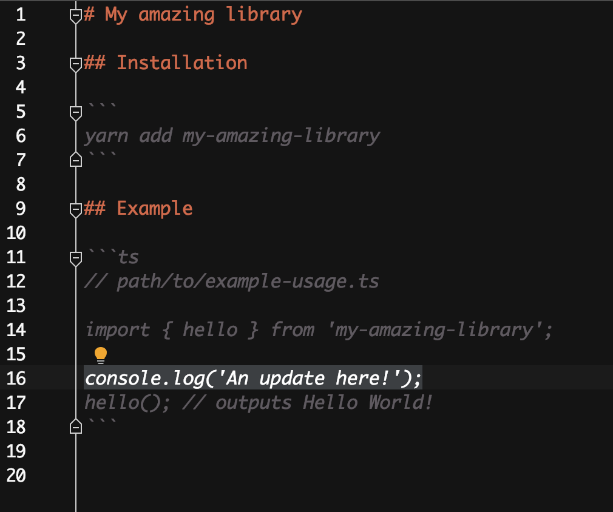

## The problem

It is the first interaction a developer will have with your library. They hear about the library through various means, but they will at some point all end up at the README. It is critical that their first impression is good, and nothing can turn a developer off a library than the example code blocks in the README not actually working.

Markdown itself doesn't do much to help us - it is a simple markup language that knows nothing about the libraries that we're building, and it certainly can't compile the code within the code snippets that we create.

Generally, this leaves us with two options:
1. We write the code directly in markdown and cross our fingers that it will be okay
1. We write the code in a separate file, that we can test against the library and we copy-paste into the markdown document

With both options, there is a huge amount of room for mistakes. In the first case, our code might not even be valid! In the second, there is a number of files to remember to update and then remember to copy paste the content.

In both instances, we may later on introduce a breaking change to the library, and completely forget to update the docs and then we're in the worst case scenario - the documentation does not reflect the library.

I've contributed to open source a bit, and have managed to run into all these cases and while they do get picked up eventually, it is fairly embarrassing.

## The solution

Becoming fed up with this annoyance, I decided to automate the process of managing updating the README from source code snippets. I've built a little nodejs commandline utility which takes all the hassle out of maintaining a README (and other markdown documents too!).

Assuming you have nodejs installed you can simply run
```
npx embedme README.md
```

Now to begin with you're probably not going to get very useful output; you need to annotate your code blocks such that `embedme` can find the appropriate file to insert

So, let us step through an example:

Say I have the following README.md:

<!---->


What you can do with `embedme` is insert a comment in the first line of the code block:

<!--  -->


Next, if you now run the following:

<!---->


You will see output from the library indicating where it found code blocks and what it did with them (i.e. in this case, inserted the content from `path/to/example-usage.ts`).

Next, to prove the utility of the library, make a change to your source code

<!-- embedme path/to/example-usage.ts -->
```ts
import { hello } from 'my-amazing-library';

console.log('An update here!');
hello(); // outputs Hello World!

```

Then rerun `embedme`:

<!--  -->

You will see your readme file has updated:

<!--  -->

So, as you've now seen, we're in a situation where out example code is outside of the README, but with a simple utility we can have it be up to date. Not only that, but we can (and should!) unit test this example code against our library, which will ensure that if we cause breaking changes to our library, we are guaranteed that the documentation will be kept up to date with correct code snippets.

Embedme has a number of other features, including...
- extracting specific lines (`//path/to/your/file.ts#L10-L20`)
- `--verify` flag which doesn't actually write to file, but checks there are not changes (good for CI scripts!)
- `--stdout` flag to output the change to be stdout in order to be redirected to another file
- using markdown comment syntax to define code blocks without being required to insert the comment within the code block. (`<!-- embedme path/to/your/file.ts -->`)
- and a few other handy features...

I encourage you to view the library for more info - https://github.com/zakhenry/embedme and add it to your automated workflow to get documentation that is both a pleasure to write, and guaranteed to be valid.

---

[<sub>Photo by Andrea Sonda on Unsplash</sub>](https://unsplash.com/@andreasonda?utm_medium=referral&amp;utm_campaign=photographer-credit&amp;utm_content=creditBadge)
