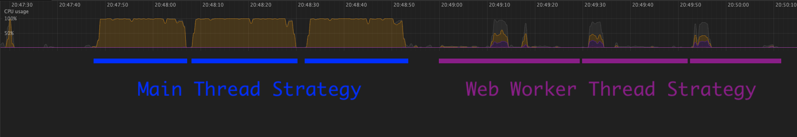

In the [previous article](https://dev.to/zakhenry/observable-webworkers-with-angular-8-4k6) we took a look at the library [`observable-webworker`](https://github.com/cloudnc/observable-webworker) which lets us use familiar observable patterns to construct and manage Web Workers and the communication between the threads. In this article we will develop an application, first without a web worker, then refactor it to use a web worker to demonstrate the power and usefulness of web workers. If you haven't read the previous article, I do recommend you do so first as it goes over all the prerequisites to getting up and running, and the background of what web workers are, which I will skip over here.

This article is a deep dive for advanced developers, so get yourself a beverage and settle in. I'm assuming moderate to advanced knowledge of Typescript and RxJS in this article, so if you're a beginner this may not be for you I'm afraid. Here's a table of contents so you can come back to this article in stints if you like.

- [Brief](#brief)
- [Data Flow Plan](#data-flow-plan)
- [Algorithm](#algorithm)
- [Application](#application)
  - [Common functionality](#common-functionality)
  - [Service](#service)
  - [Component](#component)
  - [Main Thread Test](#main-thread-test)
  - [Worker](#worker)
  - [Worker Thread Test](#worker-thread-test)
- [Performance](#performance)
- [Wrap Up](#wrap-up)

## Brief

The application we're going to build has a few requirements, I'll lay these out as acceptance criteria that we can refer to later.

> As a user I want to be able to search through text of a variety of novels fetched from [Project Gutenberg](https://www.gutenberg.org/). My search results should contain my search phrase highlighted within the context of the matching paragraph. When I typo or misspell words I should still get expected results.

For fun I'll detail the criteria in the [BDD Gherkin syntax](https://cucumber.io/docs/guides/10-minute-tutorial/)

```feature
Feature: Find phrases in books by searching for them

    Background:
        Given I'm a user on the home page
        And I have selected the book "Alice in Wonderland"
        And I see a free text field in which I can type my search phrase
    
    # basic search
    Scenario
        When I type "we’re all mad here"
        Then I should see the first search result containing the text "‘Oh, you can’t help that,’ said the Cat: ‘we’re all mad here. I’m mad. You’re mad.’"
    
    # multiple result search
    Scenario
        When I type "mad"
        Then I should see search results with "mad" highlighted at least "10" times
    
    # search with typos
    Scenario
        When I type "were all madd her"
        Then I should see the first search result containing the text "‘Oh, you can’t help that,’ said the Cat: ‘we’re all mad here. I’m mad. You’re mad.’"
```

Additional to these user journey requirements, we will have the following performance requirements:

- the user interface must remain responsive at all times
- the user gets their search results live with every keystroke
- the user can change book and the search immediate begins returning results for their previous search

The difficult part to take particular note of in the requirements is the ability to handle typos and misspellings. This explodes the problem complexity as it is not as simple as finding a substring of a paragraph; rather we need to score candidate substrings to find the best match.

## Data Flow Plan

To start with we will put together a simple typescript file proving out the observable flow, then later build it into the application.

```ts
// playground/observable-flow.ts

import { from, Observable, of } from 'rxjs';
import { scan, shareReplay, switchMap } from 'rxjs/operators';

/**
 * First off, we create a quick enum of the books we will use as a demo. Later
 * we will update the urls to be correct
 */
enum BookChoice {
  ALICE_IN_WONDERLAND = 'http://some-url-to-alice-in-wonderland-text',
  SHERLOCK_HOLMES = 'http://some-url-to-sherlock-holmes-text',
}

/**
 * This observable will be something like a regular dropdown, emitted whenever
 * the user changes their selection.
 */
const userBookSelection$ = of(BookChoice.ALICE_IN_WONDERLAND);

/**
 * This observable represents the stream of search terms the user will enter
 * into a text box. We `shareReplay(1)` so that subsequent subscribers will get
 * the latest value
 */
const userSearchTerm$ = of(`we’re all mad here`).pipe(shareReplay(1));

/**
 * This function will be responsible for fetching the content of the book given
 * the enum. We're cheating a little by making the enum value the url to fetch.
 * For now we will just pretend the url is the content of the book.
 * @todo implement
 */
function getBookText(bookChoice: BookChoice): Observable<string> {
  return of(bookChoice);
}

/**
 * This function will be responsible for taking the search term and returning
 * the stream of paragraphs found, as soon as they are found.
 *
 * For the purposes of quick testing, we've hardcoded as if two search results
 * were found
 *
 * We will also likely extend this return type in future to handle highlighting
 * the search phrase, but for now just the paragraph is sufficient for testing
 * @todo implement
 */
function getSearchResults(
  searchTerm: string,
  bookText: string,
): Observable<string> {
  return from([
    searchTerm + ' (this will be the first result)',
    searchTerm + ' (this will be the second result)',
  ]);
}

/**
 * Here we take the user selected book stream and pipe it via switchMap to fetch
 * the content of the book. We use switchMap() because we want to cancel the
 * download of the book if the user switches to a different book to search
 * before the book has finished downloading.
 *
 * Next we again switchMap() the result of the book content to the user search
 * term observable so that if the user has changed books, once it is loaded we
 * will cancel the processing of the current search term.
 *
 * Next we pass that stream of search terms to getSearchResults() which will
 * itself be returning a stream of search results for that search string.
 *
 * Finally, we use a scan() operator to collate the stream of search results
 * into an array so that we can present all results to the user, not just the
 * most recent one
 */
const searchResults$ = userBookSelection$.pipe(
  switchMap(selection => getBookText(selection)),
  switchMap(bookText => {
    return userSearchTerm$.pipe(
      switchMap(searchTerm =>
        getSearchResults(searchTerm, bookText).pipe(
          scan((searchResults: string[], searchResult) => {
            return [...searchResults, searchResult];
          }, []),
        ),
      ),
    );
  }),
);

/**
 * Last but not least, to check our logic, we subscribe to the observable and
 * bind the console so we see output.
 */
searchResults$.subscribe(console.log);

```

Alrighty, we've got a concept of what we're trying to build, so what do we get when we run it? I like to use `ts-node` for these kind of quick tests, so just run `npx ts-node --skip-project playground/observable-flow.ts` (tip: the `--skip-project` bit is just because I'm currently in a working directory that has a tsconfig.json file that is not compatible with just running a plain nodejs script.)

Our output of the above file is as follows:

<!-- embedme playground/observable-flow-out.txt -->

```txt
[ 'we’re all mad here (this will be the first result)' ]
[
  'we’re all mad here (this will be the first result)',
  'we’re all mad here (this will be the second result)'
]

```

Okay, so this is expected - we first get one result in an array, then we get both results in the array. Success? Well kinda, but we'd really like to put some realism into this script so that we can see that our observables are having the right behavior.

So, we will now edit the script we just wrote to add a bunch of realistic delays and some more logging to see what is really going on:

```ts
// playground/observable-flow-test.ts

import { from, Observable, of } from 'rxjs';
import {
  concatMap,
  delay,
  map,
  pairwise,
  scan,
  shareReplay,
  startWith,
  switchMap,
  timestamp,
} from 'rxjs/operators';

enum BookChoice {
  ALICE_IN_WONDERLAND = 'http://alice.text',
  SHERLOCK_HOLMES = 'http://sherlock.text',
}

/**
 * This is a nice little custom operator that spaces out observables by a certain amount, this is super handy for
 * emulating user events (humans are slooow!)
 */
function separateEmissions<T>(delayTime: number) {
  return (obs$: Observable<T>): Observable<T> => {
    return obs$.pipe(
      concatMap((v, i) => (i === 0 ? of(v) : of(v).pipe(delay(delayTime)))),
    );
  };
}

/**
 * For the book selection, we've piped to separateEmissions() with 4000ms
 * defined, this means when subscribed the observable will immediately emit
 * Alice in Wonderland content, then 4 seconds later emit Sherlock Holmes content.
 */
const userBookSelection$ = from([
  BookChoice.ALICE_IN_WONDERLAND,
  BookChoice.SHERLOCK_HOLMES,
]).pipe(separateEmissions(4000));

/**
 * Slightly different strategy for this one - we're
 * 1. Piping delayed user book selection to vary the search phrase depending on
 * which book is selected
 * 2. creating a streams of individual characters
 * 3. spacing out the emissions by 100ms (this is the inter-keystroke time)
 * 4. using scan to combine the previous characters
 * The result is a pretty good simulation of the user typing the phrase at 10
 * keys per second
 */
const userSearchTerm$ = userBookSelection$.pipe(
  delay(200),
  switchMap(book => {
    const searchPhrase =
      book === BookChoice.ALICE_IN_WONDERLAND
        ? `we’re all mad here`
        : `nothing more deceptive than an obvious fact`;

    return from(searchPhrase).pipe(
      separateEmissions(100),
      scan((out, char) => out + char, ''),
    );
  }),
  shareReplay(1),
);

/**
 * Here, we're guessing it will take about 200ms to download the book. We've
 * also put in a console.log so we can make sure we're not going to try download
 * the book on every keystroke!
 * @param bookChoice
 */
function getBookText(bookChoice: BookChoice): Observable<string> {
  console.log(`getBookText called (${bookChoice})`);
  return of(bookChoice).pipe(delay(200));
}

/**
 * With this function we're saying that the search takes (20 milliseconds * the
 * length of the search string)
 * This is actually totally unrealistic, but the linear variability will help
 * when understanding the logs
 */
function getSearchResults(
  searchTerm: string,
  bookText: string,
): Observable<string> {
  return from([' (first search result)', ' (second search result)']).pipe(
    map(result => `${bookText} : ${searchTerm} : ${result}`),
    delay(20 * searchTerm.length),
    separateEmissions(200),
  );
}

/**
 * This is unchanged from before
 */
const searchResults$ = userBookSelection$.pipe(
  switchMap(selection => getBookText(selection)),
  switchMap(bookText => {
    return userSearchTerm$.pipe(
      switchMap(searchTerm =>
        getSearchResults(searchTerm, bookText).pipe(
          scan((searchResults: string[], searchResult) => {
            return [...searchResults, searchResult];
          }, []),
        ),
      ),
    );
  }),
);

/**
 * Lastly we'd doing a few tricks to make the output express what happened
 * better.
 * The combination of timestamp and pairwise gives us a stream of when the
 * emission happened and bundles it with the previous one so we can compare
 * times to get a time taken value. The startWith(null) just gives us the
 * startup time as a baseline.
 * Lastly we use our old friend map() to output the data in a nice format for
 * the logger.
 */
searchResults$
  .pipe(
    startWith(null),
    timestamp(),
    pairwise(),
    map(([before, tsResult], i) => {
      const timeSinceLast = (tsResult.timestamp - before.timestamp) / 1000;
      return `${i} : Search Result: [${tsResult.value.join(
        ', ',
      )}] (+${timeSinceLast} seconds)`;
    }),
  )
  .subscribe(console.log);

```

<!-- npx ts-node --skip-project playground/observable-flow.ts > playground/observable-flow-out.txt -->
<!-- embedme playground/observable-flow-test-out.txt -->

```txt
getBookText called (http://alice.text)
0 : Search Result: [http://alice.text : w :  (first search result)] (+0.431 seconds)
1 : Search Result: [http://alice.text : we :  (first search result)] (+0.123 seconds)
2 : Search Result: [http://alice.text : we’ :  (first search result)] (+0.128 seconds)
3 : Search Result: [http://alice.text : we’r :  (first search result)] (+0.121 seconds)
4 : Search Result: [http://alice.text : we’re :  (first search result)] (+0.121 seconds)
5 : Search Result: [http://alice.text : we’re all mad here :  (first search result)] (+1.6 seconds)
6 : Search Result: [http://alice.text : we’re all mad here :  (first search result), http://alice.text : we’re all mad here :  (second search result)] (+0.204 seconds)
getBookText called (http://sherlock.text)
7 : Search Result: [http://sherlock.text : n :  (first search result)] (+1.704 seconds)
8 : Search Result: [http://sherlock.text : no :  (first search result)] (+0.125 seconds)
9 : Search Result: [http://sherlock.text : not :  (first search result)] (+0.124 seconds)
10 : Search Result: [http://sherlock.text : noth :  (first search result)] (+0.125 seconds)
11 : Search Result: [http://sherlock.text : nothi :  (first search result)] (+0.122 seconds)
12 : Search Result: [http://sherlock.text : nothing more deceptive than an obvious fact :  (first search result)] (+4.68 seconds)
13 : Search Result: [http://sherlock.text : nothing more deceptive than an obvious fact :  (first search result), http://sherlock.text : nothing more deceptive than an obvious fact :  (second search result)] (+0.201 seconds)

```

Alrighty let's dig into this a bit.

We can see straight away that we fetch the Alice in Wonderland book immediately, and never again - this is perfect.

Next as the phrase begins to be typed we first get one result, then the other is appended to the results, good good.

Later on (the line starting with `5`) we can see that the search result slowdown has meant that we're getting results less frequently and they are for longer search phrases than just the next character - this is what we expect as it means that the `switchMap` is unsubscribing from the search processor function as there is different data to be processed. This is a great opportunity to compare the different behaviors of `switchMap()`, `mergeMap()` and `exhaustMap()`:

- If we had chosen `mergeMap()`, we would see every single search result for every keystroke, but likely all overlapping with each other and would be pretty confusing. Also the overall time would be longer, assuming the CPU was saturated while processing the search.

- If we had chosen `exhaustMap()`, we would get the exhaustive set of results (hence the name!) in the correct order, however the overall time would be _way_ longer as we had to wait sequentially.

In this case I think `switchMap()` is the correct behavior as the user is not interested in interim search results before they have finished typing, and we gain efficiency by immediately cancelling computation of irrelevant search results.

Back to the output analysis, in the line marked `7` we see we've switched to fetching Sherlock Holmes with the new search phrase. Success!

Okay, we're in a state now where we're pretty confident in the general data flow, let's cover the algorithm we will use to score paragraphs, then later start building the application.

## Algorithm

Given the requirement that our search terms may contain typos and misspellings, the algorithm to find the best paragraph to show the user is non trivial. There are a number of different fuzzy string matching algorithms, each with their own strengths & weaknesses. Given our requirement is about typos and misspellings, not word order mistakes, computing the [Levenshtein distance](https://en.wikipedia.org/wiki/Levenshtein_distance) sounds like a great candidate.

Levenshtein distance is the number of changes required to change one string to another. The changes can be either insertions, deletions or substitutions. The distance is simply the minimum count of changes.

As an example the distance between `hello` and `helo` is `1` because there is one insertion required. Two identical strings will have a distance of `0`.

Now our inputs don't quite suit this algorithm as we're comparing a small search phrase with a large paragraph - our distance scoring will mostly indicate the difference in length of the search term and the paragraph. Instead we will modify the algorithm to ignore the start and end of the search string such that we compute the minimum Levenshtein distance of the search string when placed anywhere in the paragraph.

Finally, we will normalize Levenshtein distance against the length of the search string in order to compute a similarity score. This will be used to rank the paragraphs by best match.

In order to not make this article any longer than it already is, I'm going to skip over the implementation, but you can dig in to it yourself at https://github.com/zakhenry/blog-posts/tree/master/posts/observable-workers-deep-dive/src/app/book-search/common/fuzzy-substring.ts

What is important to know is that there is a function `fuzzySubstringSimilarity`:

```ts
// src/app/book-search/common/fuzzy-substring.ts#L70-L73

export function fuzzySubstringSimilarity(
  needle: string,
  haystack: string,
): FuzzyMatchSimilarity {
```

which returns `FuzzyMatchSimilarity`:

```ts
// src/app/book-search/common/fuzzy-substring.ts#L1-L9

export interface FuzzyMatch {
  substringDistance: number;
  startIndex: number;
  endIndex: number;
}

export interface FuzzyMatchSimilarity extends FuzzyMatch {
  similarityScore: number;
}
```

We will be using this return type to both score the paragraphs of the novel and return the start and end index of the match so we can highlight it in the output.

Let's test the algorithm against the user story defined above:

<!-- embedme playground/fuzzy-substring-test.ts -->
```ts
import { fuzzySubstringSimilarity } from '../src/app/book-search/common/fuzzy-substring';

const similarity = fuzzySubstringSimilarity(
  'were all madd her',
  '‘Oh, you can’t help that,’ said the Cat: ‘we’re all mad here. I’m mad. You’re mad.’',
);
console.log(`Similarity: `, similarity);

```
All we're doing here is defining the needle as the search string, and the haystack as the expected matching sentence. If we run this file we get the following:
<!-- npx ts-node --skip-project playground/fuzzy-substring-test.ts > playground/fuzzy-substring-test-out.txt -->
<!-- embedme playground/fuzzy-substring-test-out.txt -->
```txt
Similarity:  {
  substringDistance: 2,
  startIndex: 42,
  endIndex: 59,
  similarityScore: 0.8823529411764706
}

```

As expected, we see a substringDistance of `2` (to get to the expected substring we need to add a `'` and remove a `d`, two changes, distance is `2`). We can also see that the `similarityScore` is very high (range is 0-1) so we can expect this search to score highly on this paragraph against other paragraphs.

Okay, we now have a algorithm sorted, and a data flow to manage it. Let's build an app! 

## Application

So far we've just been working with single typescript files, to work through our ideas, but now we're going to jump into using a framework as this is much more realistic to our real world problems we hope to solve by understanding this article.

I'm going to use Angular, but if you prefer any of the other awesome frameworks don't fret as this is going to be fairly framework agnostic anyway. If you've made it this far, it's probably safe to assume you have the basics of framework development down pat so I'll gloss over that.

```
ng new observable-workers-deep-dive
```

```
ng generate component book-search
```

Ok, we've got a basic framework scaffolded, given we're trying to test the difference between using observables directly, and using observables with web workers, as we build out the application we will try to extract the common functionality into one place. That way as many variables as possible are controlled during our performance tests as the worker and main thread strategies will be using the exact same core algorithm code.

### Common functionality

To start with we will build a utility function to handle getting a stream of fuzzy-match scored paragraphs: 

```ts
// src/app/book-search/common/book-search.utils.ts#L8-L25

export interface SearchMatch {
  searchString: string;
  paragraph: string;
  paragraphNumber: number;
  searchMatch: FuzzyMatchSimilarity;
}

export function getSearchResults(
  searchString: string,
  paragraphs: string[],
): Observable<SearchMatch> {
  return from(paragraphs).pipe(
    observeOn(asyncScheduler),
    map((paragraph, index) => {
      const searchMatch = fuzzySubstringSimilarity(searchString, paragraph);
      return { searchMatch, paragraph, paragraphNumber: index, searchString };
    }),
  );
```

Some very important things to note here. We're converting the array of paragraphs to an observable stream of individual paragraphs with `from()`. 

After this we use `observeOn(asyncScheduler)` - this is _critical_ to the responsiveness of the application. Basically what this is doing is rescheduling the emissions of the `from()` observable from being synchronous to asynchronous. This allows subscribers to our stream to disconnect from the paragraph stream **without having to compute the fuzzy substring scores for the entire book**. This will allow us to discard partial search results when the search string becomes invalid due to the user typing more characters.

Finally we `map()` to the computation function, and attach the paragraph index number to the output - we will later use this to work out how far along the computation is as a percentage.


Next up for our common functions is an accumulation function that will 
1. take our stream of search results
1. collate them into an array
1. order the array of results by score
1. take the top ten results
1. slice up the resulting paragraph into non matching text and matching text

```ts
// src/app/book-search/common/book-search.utils.ts#L27-L77


export interface MatchingParagraph {
  before: string;
  match: string;
  after: string;
  score: number;
}

export interface SearchResults {
  paragraphs: MatchingParagraph[];
  searchedParagraphCount: number;
  paragraphCount: number;
}

export function accumulateResults(paragraphCount: number) {
  return (obs$: Observable<SearchMatch>): Observable<SearchResults> => {
    return obs$.pipe(
      scan((searchResults: SearchMatch[], searchResult: SearchMatch) => {
        searchResults.push(searchResult);
        return searchResults;
      }, []),
      startWith([]),
      map(
        (searchMatches: SearchMatch[], index): SearchResults => {
          const last = searchMatches[searchMatches.length - 1];

          return {
            searchedParagraphCount: index,//last ? last.paragraphNumber + 1 : 0,
            paragraphCount,
            paragraphs: searchMatches
              .sort(
                (a, b) =>
                  b.searchMatch.similarityScore - a.searchMatch.similarityScore,
              )
              .slice(0, 10)
              .map(({ searchMatch, paragraph }) => {
                return {
                  score: searchMatch.similarityScore,
                  match: paragraph.substring(
                    searchMatch.startIndex,
                    searchMatch.endIndex,
                  ),
                  before: paragraph.substring(0, searchMatch.startIndex),
                  after: paragraph.substring(searchMatch.endIndex),
                };
              }),
          };
        },
      ),
    );
  };
```

Despite the line count, there is nothing particularly complex in here, some points to note however:
- The `scan()` operator is used so that we get results streamed as they come in, if we wanted to wait for completion of the search we would use `reduce()` (the rxjs operator, not `Array.prototype.reduce`) 
- We use `startWith([])` so that a subscriber immediately gets an empty result set on subscription

Lastly we combine these two functions into a single one that accepts a search term and a book, and returns the accumulated stream of search results.


```ts
// src/app/book-search/common/book-search.utils.ts#L79-L87


export function getAccumulatedSearchResults(
  searchTerm: string,
  bookText: string,
): Observable<SearchResults> {
  const paragraphs = bookText.split('\n\n');
  return getSearchResults(searchTerm, paragraphs).pipe(
    accumulateResults(paragraphs.length),
  );
```

### Service
Ok, basic functions that do the heavy lifting are all sorted, we're pretty much on the home stretch! Let's create a service to wrap this logic that we will later use in our component.

```ts
// src/app/book-search/main-thread/book-search.service.ts#L11-L44

@Injectable({
  providedIn: 'root',
})
export class BookSearchService {
  constructor(private http: HttpClient) {}

  public search(
    bookSelection$: Observable<BookChoice>,
    searchTerm$: Observable<string>,
  ): Observable<SearchResults> {
    return this.processSearch(bookSelection$, searchTerm$).pipe(
      auditTime(1000 / 60), // emit results at a maximum of 60fps
      share(),
    );
  }

  protected processSearch(
    url$: Observable<string>,
    search$: Observable<string>,
  ): Observable<SearchResults> {
    const sharedSearchTerm$ = search$.pipe(shareReplay(1));

    return url$.pipe(
      switchMap(url => this.http.get(url, { responseType: 'text' })),
      switchMap(bookText => {
        return sharedSearchTerm$.pipe(
          switchMap(searchTerm => {
            return getAccumulatedSearchResults(searchTerm, bookText);
          }),
        );
      }),
    );
  }
}
```
With this service, we inject an `HttpClient` into the constructor; this allows us to fetch the book content. Next is a public method that we will use in our component. It takes two streams:
- the first is the `BookChoice`. Recall from earlier this is a string enum with the values being the URl of the book
- the second is the search phrase itself that is used for fuzzy matching against the paragraphs of the book

We call out to a local `processSearch` method which simply takes the url and pipes it to a `switchMap()` that fetches the content, then in turn pipes to the search term observable and finally we switch on that observable to call out to `getAccumulatedSearchResults` that we built earlier.

Back in the `search()` method, we pipe the results from `processSearch()` and first use the `auditTime()` operator. This restricts the data output rate to 60 frames per second otherwise we could potentially get tens of thousands of `SearchResults` per second, which would completely oversaturate the change detection strategy of the framework when we try to display the results in the DOM.

Lastly we add a `share()` to the search results as we don't want multiple subscribers to trigger computation of the search results more than once.

Next let's define the component logic to connect this service to user input.

### Component
Our component requirements are super simple - it needs to provide a form control for both the book selection and the search term, then output the results of the search.


```ts
// src/app/book-search/main-thread/book-search.component.ts#L13-L59


@Component({
  selector: 'app-book-search',
  templateUrl: './book-search.component.html',
  styleUrls: ['./book-search.component.css'],
  changeDetection: ChangeDetectionStrategy.OnPush,
})
export class BookSearchComponent {
  public componentName = 'Main thread search';

  public bookChoices = [
    {
      url: BookChoice.ALICE_IN_WONDERLAND,
      name: 'Alice in Wonderland',
    },
    {
      url: BookChoice.SHERLOCK_HOLMES,
      name: 'Sherlock Holmes',
    },
    {
      url: BookChoice.WAR_AND_PEACE,
      name: 'War and Peace',
    },
  ];

  public bookSelectionFormControl = new FormControl(null);
  public userBookSelection$: Observable<BookChoice> = this
    .bookSelectionFormControl.valueChanges;

  public searchTermFormControl = new FormControl(null);
  public userSearchTerm$: Observable<string> = this.searchTermFormControl
    .valueChanges;

  private searchResults$: Observable<
    SearchResults
  > = this.bookSearchHandler.search(
    this.userBookSelection$,
    this.userSearchTerm$,
  );

  public searchResultParagraphs$: Observable<
    MatchingParagraph[]
  > = this.searchResults$.pipe(map(result => result.paragraphs));

  public searchResultProgress$: Observable<
    [number, number]
  > = this.searchResults$.pipe(
```

Points of interest in this component:
- we construct a new `FormControl` for the book selection, then immediately set up an observable that observes the `valueChanges` of that control
- we do the same thing for the search terms
- next we construct the `private searchResults$: Observable<SearchResults>` using the previous two observables, it calls out to the service that we just defined earlier
- the last two public members observe the `searchResults$`, the first extracting the matching paragraphs, the second extracting the search progress information

Next let's take a look how this will be displayed in the template:

```html
<!-- src/app/book-search/main-thread/book-search.component.html -->

<h2>{{ componentName }}</h2>

<select [formControl]="bookSelectionFormControl">
  <option *ngFor="let book of bookChoices" [value]="book.url">
    {{ book.name }}
  </option>
</select>

<input type="text" [formControl]="searchTermFormControl" />

<span *ngIf="searchResultProgress$ | async as searchResultProgress">
  Progress: {{ searchResultProgress[0] }} / {{ searchResultProgress[1] }} ({{
    searchResultProgress[0] / searchResultProgress[1] | percent
  }})
</span>

<ng-container *ngFor="let matchingParagraph of searchResultParagraphs$ | async">
  <hr />
  <blockquote>
    <span>{{ matchingParagraph.before }}</span>
    <strong>{{ matchingParagraph.match }}</strong>
    <span>{{ matchingParagraph.after }}</span>
    <footer>Score: {{ matchingParagraph.score }}</footer>
  </blockquote>
</ng-container>

```

Nice simple template, we've got 
- a basic `<select>` to manage the book selection
- then an `<input>` to manage the user search
- then a `<span>` that outputs the search result progress
- lastly a repeated `<blockquote>` to output the results of the search

Note that we're using `AsyncPipe` to managed _all_ subscriptions - this greatly simplifies the component logic, and allows us to use `OnPush` change detection strategy as the `AsyncPipe` manages marking the component to be checked.

At long last, we're there, let us test it.

### Main Thread Test
Ok so when we run the app, we're presented with the two controls. So let's select "Alice and Wonderland" and type that typo-ridden string `"were all madd her"`


Okay! This is good - we've managed to fetch search results, and the first result is the expected match:

```
were all madd her
 Progress: 900 / 901 (100%)
‘Oh, you can’t help that,’ said the Cat: ‘we’re all mad here. I’m mad. You’re mad.’
Score: 0.8823529411764706
``` 

**However** the responsiveness of the application was awful - that gif is not stuttering, it really did lock up after typing the first character then all the results appeared after a few seconds.
Fortunately we have the incredible tool that is Web Workers up our sleeves, and we can use one to free up this oversaturated main thread to just do UI stuff, and keep our expensive search result computation in a separate thread.

### Worker
So, let's create a worker
```
ng generate web-worker book-search
```

This will put a `book-search.worker.ts` file into our application:

<!-- embedme playground/example.worker.ts -->
```ts
/// <reference lib="webworker" />

addEventListener('message', ({ data }) => {
  const response = `worker response to ${data}`;
  postMessage(response);
});

```

We don't want any of that boilerplate, so we will delete it and implement our own worker version of the `processSearch` method we created in the service earlier:

```ts
// src/app/book-search/worker-thread/book-search.worker.ts

import { DoWork, ObservableWorker } from 'observable-webworker';
import { Observable } from 'rxjs';
import { ajax } from 'rxjs/ajax';
import {
  distinctUntilChanged,
  map,
  shareReplay,
  switchMap,
} from 'rxjs/operators';
import {
  getAccumulatedSearchResults,
  SearchResults,
  WorkerInput,
} from '../common/book-search.utils';

@ObservableWorker()
export class BookSearchWorker implements DoWork<WorkerInput, SearchResults> {
  public work(input$: Observable<WorkerInput>): Observable<SearchResults> {
    const url$ = input$.pipe(
      map(({ url }) => url),
      distinctUntilChanged(),
    );

    const searchTerm$ = input$.pipe(
      map(({ searchTerm }) => searchTerm),
      distinctUntilChanged(),
      shareReplay(1),
    );

    return url$.pipe(
      switchMap(url => ajax({ url, responseType: 'text' })),
      map(result => result.response),
      switchMap(bookText => {
        return searchTerm$.pipe(
          switchMap(searchTerm =>
            getAccumulatedSearchResults(searchTerm, bookText),
          ),
        );
      }),
    );
  }
}

```
This ought to look pretty familiar, as it is really just the `processSearch` function within a `@ObservableWorker()`- decorated class from the [`observable-webworker`](https://github.com/cloudnc/observable-webworker) package. The only difference is that the input to the `work()` method is a single stream of `Observable<WorkerInput>` which we split and observe separately.

From there it is essentially identical, though we do use the rxjs `ajax()` method rather than `HttpClient` as the `Injector` is not available in the worker context.

Now for the main thread class to manage this worker:

```ts
// src/app/book-search/worker-thread/book-search-worker.service.ts

import { Injectable } from '@angular/core';
import { fromWorker } from 'observable-webworker';
import { combineLatest, Observable } from 'rxjs';
import { map } from 'rxjs/operators';
import { BookSearchService } from '../main-thread/book-search.service';
import { SearchResults, WorkerInput } from '../common/book-search.utils';

@Injectable({
  providedIn: 'root',
})
export class BookSearchWorkerService extends BookSearchService {
  protected processSearch(
    url$: Observable<string>,
    search$: Observable<string>,
  ): Observable<SearchResults> {
    const input$: Observable<WorkerInput> = combineLatest(url$, search$).pipe(
      map(([url, searchTerm]) => ({ searchTerm, url })),
    );

    return fromWorker(
      () => new Worker('./book-search.worker', { type: 'module' }),
      input$,
    );
  }
}

```

Because we've already implemented the `search()` logic in `BookSearchService` we simply extend that class and override the implementation of `processSearch()` in a new `BookSearchWorkerService` class.

In a real situation you probably would just replace the `processSearch` method, but we're going to have two implementations in this article so we can compare them side-by-side later.

Our implementation of `processSearch` is super simple, we `combineLatest` the two input streams into the form that the Worker required. Then we use the `fromWorker()` method from `'observable-webworker'` to wrap the construction of a `new Worker` and pass the input stream as the second argument.

Now, while we're trying to preserve the old behaviour, we need a new component to show off this shiny new worker backed service:

```ts
// src/app/book-search/worker-thread/book-search-worker.component.ts

import { ChangeDetectionStrategy, Component } from '@angular/core';
import { BookSearchWorkerService } from './book-search-worker.service';
import { BookSearchComponent } from '../main-thread/book-search.component';
import { BookSearchService } from '../main-thread/book-search.service';

@Component({
  selector: 'app-book-search-worker',
  templateUrl: '../main-thread/book-search.component.html',
  styleUrls: ['../main-thread/book-search.component.css'],
  changeDetection: ChangeDetectionStrategy.OnPush,
  providers: [
    { provide: BookSearchService, useClass: BookSearchWorkerService },
  ],
})
export class BookSearchWorkerComponent extends BookSearchComponent {
  public componentName = 'Worker thread search';
}

```

Not much going on here! All we're doing is extending the `BookSearchComponent`, reusing it's template and styles, and providing our new `BookSearchWorkerService` instead of the default `BookSearchService`.

Now in our `app.component.html` template we can insert this new component:

```html
<!-- src/app/app.component.html -->

<app-book-search></app-book-search>
<app-book-search-worker></app-book-search-worker>
<app-book-search-multi-worker></app-book-search-multi-worker>

```

So now we have our two implementations of book search - one in the main thread, the other backed by a worker thread service.

### Worker Thread Test
Let's test the new worker component! 


Wow! How's that for performance?! Now I wouldn't call this the nicest of user experiences, but you can really see the power of web workers in action here.

Also in this demo you can really see the reason we had to `auditTime()` the search results as the DOM update frequency here is super high. In fact, if you comment out that function, you will find that the web worker implementation performance is significantly **worse** as it is emitting search results at such a high frequency that it causes a backpressure of change detection cycles for Angular, making the overall performance actually worse. This was a real takeaway lesson for me, and hopefully you too - 

**Web Workers can make your computation output so fast that displaying the results in the DOM can become a major overall bottleneck**


Visual comparisons are all well and good, but let's properly look into how the performance differs between the two strategies

## Performance
To test the relative performance I will search the phrase `"There is nothing more deceptive than an obvious fact"` within the Sherlock Holmes book. I'll do it three times using the regular main thread strategy, clearing the input each time, then the same for the web worker strategy.

<!---->


From these graphs it is clear the difference using a web worker makes - the main thread (in yellow in this graph) holds at 100% for a full 15 seconds, during which repainting will suffer greatly. With the web worker strategy, the main thread barely peaks at 50% utilisation, and is actually mostly idle for the duration. 

It is worth noting at this time that the overall duration is roughly the same, and it would be expected that in some circumstances the worker strategy might be slightly slower overall. This is because the strategy requires spinning up a new thread, and structured copying of the data flowing between threads is not zero-cost.

One other consideration is that we're not fully utilising the power of web workers - the computation job that we're running can easily be broken up into smaller tasks for _multiple_ workers, and processed using a thread pool strategy. This is a topic for another article, and I might just be covering that one next.

## Wrap Up
You've reached the end! This was a bit of a marathon I'm afraid but there was an awful lot of content to cover. In summary, we outlined a real world scenario where users want to robustly do full text search over a novel, we then came up with a data flow strategy, then an algorithm, then built it out into an application, then refactored to use an observable web worker strategy, and finally did some performance metrics to prove the utility of web workers. Phew!

The code is [all available on Github](https://github.com/zakhenry/blog-posts/tree/master/posts/observable-workers-deep-dive) so please feel free to clone it and have a play. If you spot any errors or room for improvement please do raise an issue or a pull request, I'm learning too!

Next in this series, I will be either demonstrating how to further improve the performance of this application using thread pools, or implementing a new real world use case that does intensive image manipulation which will demonstrate high performance techniques of passing large data between threads. Let me know if you have a preference!

Thanks again for staying with me here, I hope that this article has been useful to you.  

[<sub>Photo by Annie Spratt on Unsplash</sub>](https://unsplash.com/@anniespratt?utm_medium=referral&amp;utm_campaign=photographer-credit&amp;utm_content=creditBadge)
